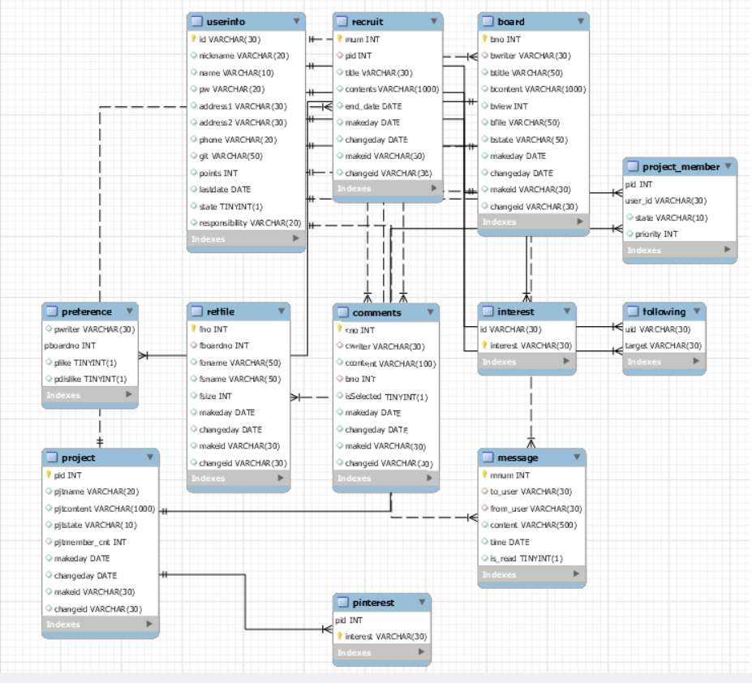

백엔드 개발

기본적인 구인구직 데이터와 프로젝트 데이터에 대한 DB 연동 및 CRUD 기능 구현

https://opentutorials.org/course/2717/11274
    - aws 관련 정보 사이트
    
데이터 베이스 구축 완료

필요한 4개 테이블 (project, project_member, recruit, interest) 에 대한 crud 기능 구현

